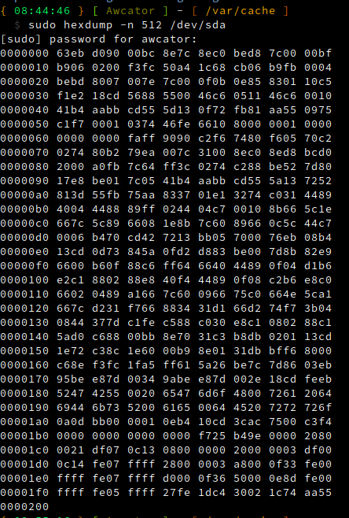

# 0. Powered on

When powered on, BIOS (Firmware) starts up,
and It starts looking into the first 512 bytes of the first sector in every hard drive/USB pen drive etc.
to see which device is the bootable device.
This does by checking 511/512th byte of first sector in every storage device, if it has the magic byte 0xAA55.
The partition with the first 512bytes that contains identifies itself with the signature "0xAA55"
is called MBR (master boot record) partition.
Bios load up the bootloader from the MBR.
It won't contain exactly 512Bytes of code,[it has its own structure](https://en.wikipedia.org/wiki/Master_boot_record)
And Bios executes binary that resides within the boot sector. 

# 0.1 BootLoader

So inside the boot sector, there will be a binary called bootloader (e.g., Grub).
Now the CPU will execute the bootloader, bootloader knows about partition tables/file systems.
It understands which OS lies in which partition of the disk using its configs (For Grub: /boot/grub/grub.cfg)  
Job of bootloader is run detect kernel, and handover the CPU to kernel.
We have to tell the bootloader to load our kernel binary file into the memory.
Now bootloader loads up the kernel into memory and asks the CPU to jump into the kernel at the exact location 0x7C00.
So whatever code is written in the kernel binary it will be executed.
Which is our OS code
read documentation [bootloader.asm](bootloader/bootloader.asm.md) for more.
