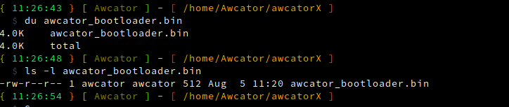
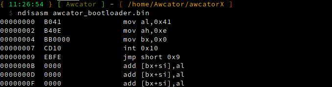
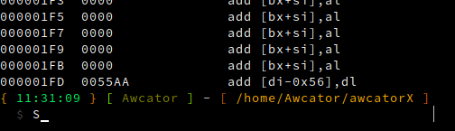
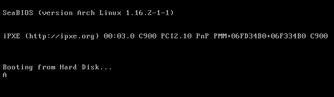

BIOS itself is a tiny kernel. To do anything from bootloader, you have to leverage BIOS using interrupts.
A well-documented bios interrupts can be found at [ralf brown interrupt list](http://www.ctyme.com/intr/int.htm)
<br>
BIOS loaded the bootloader and placed it in the memory address 0x7C00. It runs the first instruction in 0x7c00.
What we do here is we have to specify "assembly origin", so that our bootloader code knows it is running in 0x7c00,
suitably it understands how to offset data, stack, adjusts its InstructionPointer register etc.
or the other way is to start with address 0x0000 and jump to 0x7c00 memory address.<br>
And note bootloader must run in 16bit code also known as real mode, for keeping backward compatible. In this mode, your
bootloader can jump to x86 mode (also known as protected mode) or x64 mode (long mode) based on our needs.

# Compiling

```shell
nasm -f bin bootloader/bootloader.asm -o awcator_bootloader.bin

# -f bin we tell nasm to generate low level binary file, not a elf one. At this point CPU cannot understand ELF. Binary file is a file without headers, its a raw code.
```

# Verification of binary

```shell
du awcator_bootloader.bin
ls -l awcator_bootloader.bin
ndisasm awcator_bootloader.bin
```

Du shows 4kb binary size, it is because of the file system. My filesystem block size is 4KB (Ext4), so file created even
with less than 4kb still holds up 4kb size in disk <br>
To see actual size you can use ls as shown above<br>
 <Br>
to confirm padded bytes we can disassemble binary file using<br>



# Run

```shell
file awcator_bootloader.bin
qemu-system-x86_64 -hda awcator_bootloader.bin
```

